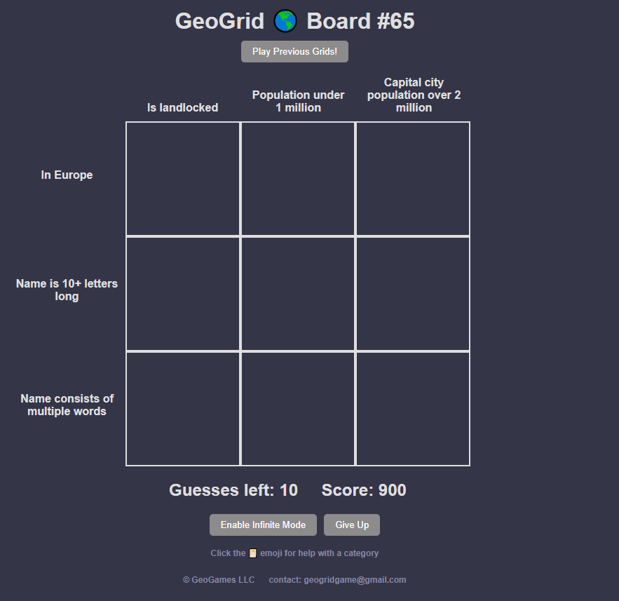
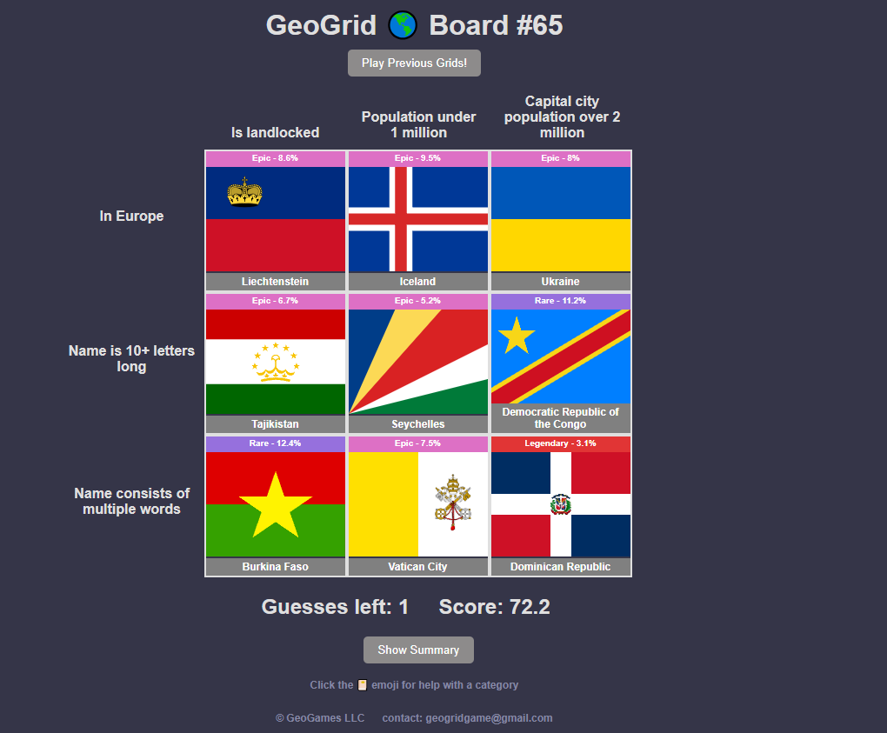

# GeoGridSolver
[GeoGrid](https://www.geogridgame.com/) is a daily trivia game made to put your geography knowledge to the test!

### How to Play
Guess a country for each box in the board that matches the criteria specified by the box's row and column categories.

Each box on any given board has anywhere from 5 to 30 unique answers.

### Rules
Players have 10 guesses to fill out the grid, but can enable infinite mode for unlimited.

A country can only be guessed once per game board.

### Objective
Complete the board by filling all 9 boxes with a country that matches the criteria for the intersection of categories.

Finish with the lowest score possible.

### Scoring
The score is calculated by the sum of the rarities of each box on the board.

Empty cells are scored as 100.

The rarer the guess, the lower the score.

The lower the score, the better.

*GeoGrid Board in June 10th*

### How to use the solver

Clone this repository:

``git clone https://github.com/HladczukLe/GeoGridSolver.git/``

Verify if .csv path is correct. 

Open the game and change the categories into the code, then you choose a country to guess.

### Categories in database
All categories (columns) in world_data.csv[^1] in order of appearance:

-  Country
-  Region
-  Population Country
-  Capital
-  Capital most pop (says whether the capital is the most populous city (Y/N))
-  Population Capital
-  HDI
-  Area (km2)
-  Population Density
-  Number of borders
-  GDP per capita
-  Olympic Medals
-  Former USSR     
-  Flag with Coat of Arms     
-  Flag with Animal            
-  Coastline on the Mediterranean
-  Hosted Olympics
-  Hosted Men's FIFA World Cup
-  Played in Men's FIFA World Cup
-  Commonwealth Member
-  Never Won an Olympic Medal
-  Coastal Distance. (Over or under specified length of coastline or if is a landlocked country)
-  Island Nation
-  Star in Flag 
-  Won Men's FIFA World Cup
-  EU Member
-  Flag with Only Red, White, and Blue 
-  Drives on the Left
-  50+ Skyscrapers
-  Top 20 Obesity Rate
-  Alcohol Prohibition
-  Top 20 Alcohol Consumption
-  Top 20 Chocolate Consumption
-  Nuclear Weapons
-  Top 20 Tourist Arrivals

For more informations about categories go to the [official website](https://www.geogridgame.com/) and click the 📔 emoji for help with a category

### Result
That was my game board in June 10th:

*GeoGrid board solved*

This code does not choose the best country to guess, it just lists all countries in the chosen categories.

[^1]: There are some categories unavailable in database (example: Flag with color)